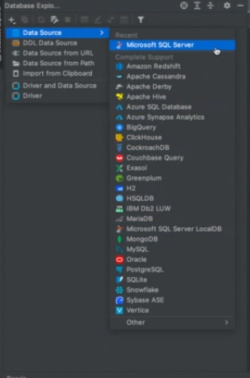
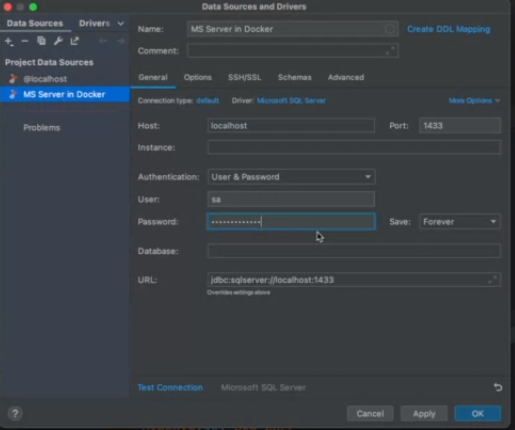
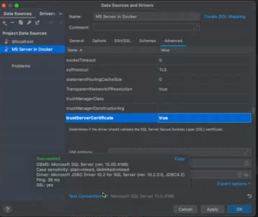
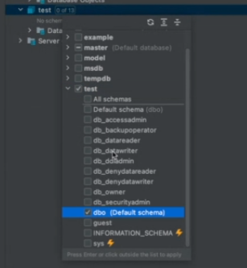

# SQL

*Apuntes de Diseño de Base de Datos*

SQL = Structured Query Language

Lenguaje estándar para acceder y manipular datos.

¿Que implica manipular? Modificar, eliminar, actualizar
  
Comandos Principales:
- SELECT
- UPDATE
- DELETE
- INSERT
- WHERE

---

## Categorías de SQL

**DCL: Data Control Language**

Pertenece a la parte de administración, gestión, tanto en el enfoque relacional como en el no relacional: NoSQL

Sentencias:

* GRANT = otorgar, dar un permiso

* DENY = denegar

* REVOKE = quitarle el permiso


**DDL: Data Definition Language**

Definir estructura de la base de datos. Eso quiere decir las tablas. Los distintos objetos.
Contenido

Datos de las tablas y relaciones que has identificado

Metadata: Armas el cascarón, pero no colocas el contenido. Permite definir como está estructurado la base de datos, las tablas y los distintos objetos dentro de la base de datos.

Datos de los datos.

Sentencias:

* CREATE = crear una nueva base de datos

Crear Base de Datos:

```SQL
CREATE DATABASE databaseName;
```

Crear Tabla:

TABLA = Compuesta de columnas, cada columna tiene un tipo

Dos formas de definirla:

```SQL
USE databaseName;
CREATE TABLE Persons(
    PersonID int,
    LastName varchar(255),
    FirstName varchar(255),
    Adress varchar(255),
    City varchar(255)
);
```

```SQL
CREATE TABLE databaseName.Persons(
    PersonID int,
    LastName varchar(255),
    FirstName varchar(255),
    Adress varchar(255),
    City varchar(255)
);
```

Copiar una tabla existente

```SQL
CREATE TABLE new_table_name AS
SELECT column1, column2, ....
FROM existing_table_name;
WHERE ....;
```

* ALTER = Alterar

Agregar, eliminar o modificar columnas en una tabla existente. No solo permite agregar columnas sino también restricciones. Agregar y eliminar CONSTRAINTS

```SQL
ALTER TABLE table_name
ADD column_name datatype;
```

Eliminar columna

```SQL
ALTER TABLE table_name
DROP COLUMN column_name;
```

Modificar el tipo de dato

```SQL
ALTER TABLE table_name
ALTER COLUMN atributo datatype;
```

En Oracle es MODIFY.

Depende del tipo de dato que quieres modificar. 

```SQL
CREATE TABLE tableName(
column1 (type size / domain) [NOT NULL],
column2 (type size / domain) [NOT NULL],
[PRIMARY KEY (c1, c2, ...., cn)],
[FOREIGN KEY (c1) REFERENCES tablex],
[CHECK (P)]
)
```

CONSTRAINT: restricción o condición que deben cumplir los datos de una tabla. Pueden ser a nivel de columnas a nivel de tablas. Cancela la opción si hay una violación hacia el CONSTRAINT.

- NOT NULL: No puede ingresar valores nulos en esta columna
- UNIQUE: Que es una solo
- PRIMARY KEY: Llave primaria, puede haber más de una
- FOREIGN KEY: Llave foranea, permite las relaciones entre tablas. Unir datos cuántas columnas.
- CHECK: Cumple una condición, predicado, una tabla en cada una de las filas
- DEFAULT: Valor por defecto al momento de crear en una fila
- CREATE INDEX: Crear indices

CONSTRAINT PRIMARY KEY: Valores **UNIQUE, NOT NULL** Puedes definirlos cuando creas la Tabla 

EJEMPLO:

```SQL
CREATE TABLE Persons(
    ID Int NOT NULL PRIMARY KEY,
    LastName varchar(255) NOT NULL,
    FirstName varchar(255),
    Age int
);
```
También puedes alterar una tabla para colocar:

```SQL
ALTER TABLE persons
ALTER COLUMN id INT NOT NULL;

ALTER TABLE persons
ADD PRIMARY KEY(id);
```
Asignar nombre a una PRIMARY KEY

```SQL
ALTER TABLE persons
ADD CONSTRAINT PK_Persons PRIMARY KEY (id);
```

FOREIGN KEY

Al crear tabla

```SQL
CREATE TABLE orders
(
    id INT NOT NULL PRIMARY KEY,
    order_number INT NOT NULL,
    persons_id INT FOREIGN KEY REFERENCES persons(id)
)
```

En Alter Table:

```SQL
ALTER TABLE orders
ADD FOREIGN KEY (PersonID) REFERENCES Persons(PersonID);
```
Asignarle un nombre

```SQL
ALTER TABLE orders
ADD CONSTRAINT FK_CustomerOrder
FOREIGN KEY (customer_id) REFERENCES customers(id);
```

* DROP = Eliminar base de datos o tablas

```SQL
DROP DATABASE databaseName;
```

```SQL
DROP TABLE Persons;
```

CONSTRAINTS

```SQL
ALTER TABLE persons
DROP CONSTRAINT PK_Persons;
```


**DML: Data Manipulation Language**

Se trabja con los datos almacenados

Sentencias:


SELECT = Puede crear, pero no modificar. Algunos lo consideran DQL

INSERT = Insertar un nuevo registro en una tabla

UPDATE = Actualizar, modificar un registro que ya existe

DELETE = Eliminar un registro

___

### Esquema de Base de Datos

Cuando creas un esquema: Todas las tablas, base de datos

Al crear base de datos especificas su nombre, creas las tablas, especificas las columnas, indicas cual es la llave primaria.

Los metadatos = estructura combinado se conocen como el esquema de la base de datos

Esquema: Tablas y sus distintas relaciones

___
- SQL Server

- Azure Data Studio

- Docker

- DataGrip

Nueva conexión








